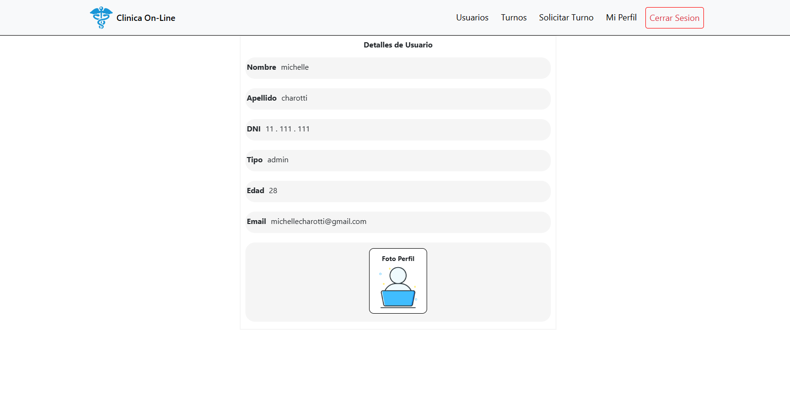

# Tpclinica

Link: https://tpclinica-1ac34.web.app/

“La Clínica OnLine, especialista en salud, cuenta actualmente con 6 consultorios, dos laboratorios físicos en
la clínica, y una sala de espera general. Está abierta al público de lunes a viernes de 8:00 a 19:00, y los
sábados de 8:00 a 14:00. En ella trabajan profesionales de diversas especialidades, que ocupan los
consultorios acorde a su disponibilidad, recibiendo pacientes con turno para consulta o tratamiento. Los
turnos son solicitados a través de la web, seleccionando el profesional o la especialidad. La duración mínima
de un turno es de 30 minutos, pero los profesionales pueden modificarla según su especialidad. Estos
profesionales pueden tener más de una especialidad. Además, contamos con un sector que se encarga de la
organización y administración de la clínica. “

### Bienvenida

### Registro
Permite generar un nuevo usuario de tipo paciente o especialista

### Login
Se permite ingreso mediante una cuenta con email y contraseña

#### Administrador
Como administrador puede:
*Visualizar su informacion personal
*Sacar turnos para pacientes
*Ver estados de todos los turnos
*Ver historial de consultas 
*Administrar la habilitacion de especialistas
*Descargar informacion 
*Generar nueva cuenta 

#### Especialista
Como especialista puede:
*Visualizar su informacion personal
*Visualizar turnos
*Ver y administrar estados de los turnos
*Ver resultado de la consulta
*Evaluar la consulta
*Administrar sus horarios

#### Paciente
Como paciente puede:
*Visualizar su informacion personal
*Sacar turnos
*Ver estados de los turnos
*Ver resultado de la consulta
*Evaluar la consulta
*Tener un historial de consultas 

